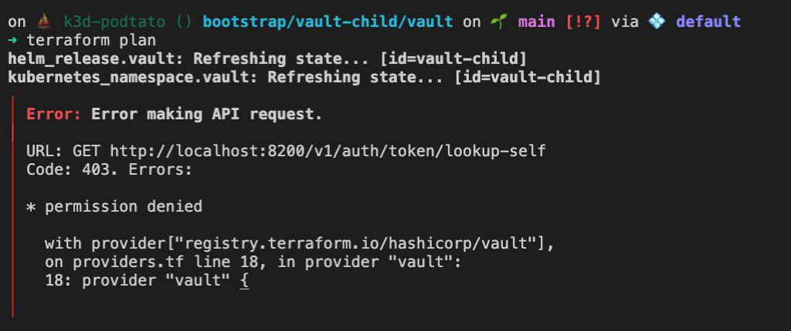

<!-- BEGIN_TF_DOCS -->
# Article Fgtech Blog - 2021-11-30

Configuration de votre environnement Vault

## Configuration de la partie Vault transit key

Pour déployer la partie Transit Key, il vous faudra un token avec suffisament de droit sur le vault master :
- un point de montage (uniquement de la cas de notre lab)
- transit key
- policy associée
- token

```bash
export VAULT_TOKEN="s.81hSWi1nwP3lrduZFv6zRare" # Pour le lab, utiliser le token root
export TF_VAR_vault_addr="http://localhost:8200" # dans notre exemple nous assumons que vous avez toujours votre portforward ouvert et que vous avez les droits de faire des actions sur le vault master
```

Configurez le nom de votre cluster

```bash
export TF_VAR_cluster="k3d-podtato"
```

## Application & Création des ressources - Injector

```bash
export TF_VAR_injector=true

terraform init
terrafor appy -f auto-approve # don't do that in production
```

## Application & Création des ressources - Injector

Utilisation du CSI entraine l'installation d'un driver supplémentaire dans votre cluster

```bash
export TF_VAR_csi=true

terraform init
terrafor appy -f auto-approve # don't do that in production

kubectl port-forward -n vault-child svc/vault-child 8100:8100
```

Ouvrez un navigateur si vous le souhaitez : [Vault UI](http://localhost:8100)

## Initialisation de votre instance de Vault

Initialisation de votre Vault. Nous partons du principe que vous avez jq d'installer sur votre machine.

```bash

VAULT_TOKEN=""; curl -s --request POST --data '{"recovery_shares": 3, "recovery_threshold": 2}' http://localhost:8100/v1/sys/init | jq
```

```console
reshold": 2}' http://localhost:8100/v1/sys/init | jq
{
  "keys": [],
  "keys_base64": [],
  "recovery_keys": [
    "fbbd035396a6c7aa299ab6591b47ac8c12c429630805d77d60f430defc443d8b7e",
    "7063e79d1a64800506b6a770bbf175fc1c30f3c6b8e2ef314d89c4937f726edd13",
    "fc18db4b3e89aa2834cc32d2e592a69257a168404b96d8880fe45512280e0962d3"
  ],
  "recovery_keys_base64": [
    "+70DU5amx6opmrZZG0esjBLEKWMIBdd9YPQw3vxEPYt+",
    "cGPnnRpkgAUGtqdwu/F1/Bww88a44u8xTYnEk39ybt0T",
    "/BjbSz6Jqig0zDLS5ZKmklehaEBLltiID+RVEigOCWLT"
  ],
  "root_token": "s.fA99WSCdYzfNkVJ3OqQyxcOk"
}
```

## Retournons à la racine

[Racine](../../)

## Troubleshoot

Si vous rencontrez cette erreur, pensez à vérifier que vous avez accès à votre application

```bash
kubectl port-forward -n vault-master svc/vault-master 8200:8200

kubectl port-forward -n vault-child svc/vault-child 8100:8100
```



## Requirements

| Name | Version |
|------|---------|
| <a name="requirement_helm"></a> [helm](#requirement\_helm) | 2.4.1 |
| <a name="requirement_kubernetes"></a> [kubernetes](#requirement\_kubernetes) | 2.6.1 |

## Providers

| Name | Version |
|------|---------|
| <a name="provider_helm"></a> [helm](#provider\_helm) | 2.4.1 |
| <a name="provider_kubernetes"></a> [kubernetes](#provider\_kubernetes) | 2.6.1 |

## Modules

| Name | Source | Version |
|------|--------|---------|
| <a name="module_transit"></a> [transit](#module\_transit) | ../transit | n/a |

## Resources

| Name | Type |
|------|------|
| [helm_release.csi_driver](https://registry.terraform.io/providers/hashicorp/helm/2.4.1/docs/resources/release) | resource |
| [helm_release.vault](https://registry.terraform.io/providers/hashicorp/helm/2.4.1/docs/resources/release) | resource |
| [kubernetes_namespace.vault](https://registry.terraform.io/providers/hashicorp/kubernetes/2.6.1/docs/resources/namespace) | resource |
| [kubernetes_secret.vault](https://registry.terraform.io/providers/hashicorp/kubernetes/2.6.1/docs/resources/secret) | resource |

## Inputs

| Name | Description | Type | Default | Required |
|------|-------------|------|---------|:--------:|
| <a name="input_cluster"></a> [cluster](#input\_cluster) | cluster Kuberntes cible | `string` | n/a | yes |
| <a name="input_csi"></a> [csi](#input\_csi) | Déploiement de l'injecteur Vault - agent k8s | `bool` | `false` | no |
| <a name="input_injector"></a> [injector](#input\_injector) | Déploiement de l'injecteur Vault - agent k8s | `bool` | `false` | no |
| <a name="input_namespace_prefix"></a> [namespace\_prefix](#input\_namespace\_prefix) | Prefix de l'ensemble de vos namespadces Vault | `string` | `"vault"` | no |
| <a name="input_vault_addr"></a> [vault\_addr](#input\_vault\_addr) | Lien vers votre vault master | `string` | n/a | yes |

## Outputs

No outputs.
<!-- END_TF_DOCS -->